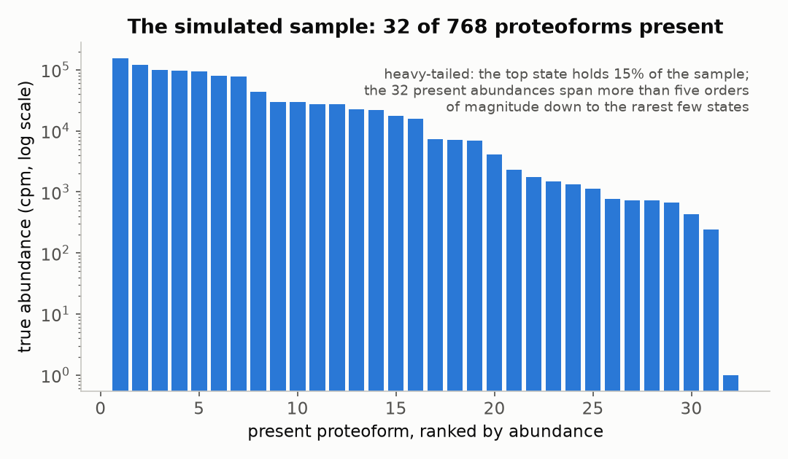
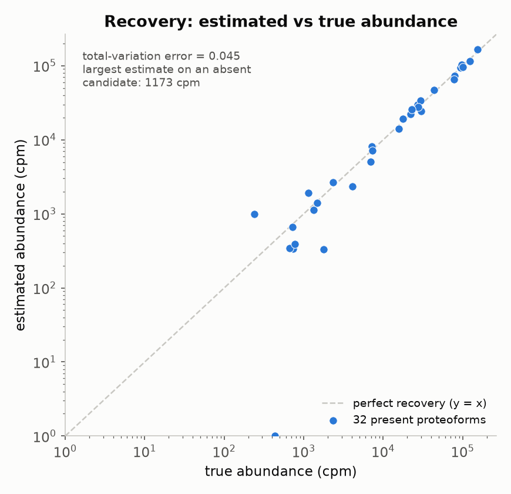

# Tutorial: simulate a sample and quantify it, step by step

This walks the whole ProteoEM pipeline from primitives: build a candidate panel,
draw a hidden ground-truth composition, simulate single-molecule affinity traces
from it, then quantify the mixture and score the estimate against the truth you
hid. It is the un-packaged version of [`examples/try_from_file.py`](examples/try_from_file.py):
nothing is tucked inside a helper, so you can see exactly what the **simulator**
knows and what the **estimator** is allowed to use.

The one line to keep in mind:

> The **simulator** owns `truth` and `identities` (Steps 3–4). The **estimator**
> sees only `Q` and `observations` (Steps 5–6). On real data, Steps 1–2 and 5–6
> are identical, Steps 3–4 are replaced by your assay export, and Step 7 does not
> exist, because there is no truth to score against.

(To use ProteoEM on **your own** data rather than a simulation, see
[`TUTORIAL.md`](TUTORIAL.md). This document is about understanding the method by
watching it run against a known answer.)

## Run it all at once, or step by step

The whole thing is one script:

```bash
python examples/simulate_and_quantify.py            # prints the seven steps
python examples/simulate_and_quantify.py --plots    # also writes the two figures
```

The `--plots` figures need the plotting extra (`pip install -e ".[figures]"`);
the numeric walkthrough needs only NumPy. The rest of this page runs the same
steps by hand in a Python session, so you can inspect each object as it appears.

Start a session from a repo checkout with ProteoEM installed:

```bash
python
```

> **REPL tip.** When you paste a multi-line `for` loop at the `>>>` prompt, press
> **Enter once more** on the blank `...` line to run it. Where a loop would trip
> on this, the blocks below use a single-line `print("\n".join(...))` form
> instead.

## Step 1 — The candidate panel

Before any data exists, you define the universe of proteoforms and the antibody
panel that reads them.

```python
import numpy as np, proteoem as P
panel = P.make_tau_like_panel(repeats=3)

print("candidates:", len(panel.candidate_ids))
print("isoforms  :", sorted(set(panel.isoforms)))
print("antibodies:", list(panel.logical_probe_ids))
print("profiles  :", np.asarray(panel.profiles).shape)
```

```
candidates: 768
isoforms  : ['0N3R', '0N4R', '1N3R', '1N4R', '2N3R', '2N4R']
antibodies: ['pan_tau_A', 'pan_tau_B', 'anti_0N', 'anti_2N', 'anti_4R', 'anti_pT181',
             'anti_pS202_pT205', 'anti_pT205', 'anti_pS214', 'anti_pT217', 'anti_pT231', 'anti_pS396']
profiles  : (768, 36)
```

The panel is **768 candidates = 6 tau isoforms × 2⁷ phospho-site combinations**,
read by **12 antibodies applied over 36 cycles** (each of the 12 probes repeated 3
times). Two objects carry the biology:

- `panel.logical_profiles` — a 768 × 12 binary **feature matrix** `E`, where
  `E[k, j] = 1` if candidate `k` carries the feature antibody `j` targets.
- `panel.cycle_to_probe` — length 36, mapping each physical cycle to its logical
  probe (`[0..11]` repeated three times).

One candidate's feature vector is just its biology in twelve bits:

```python
E = np.asarray(panel.logical_profiles)
k = list(panel.candidate_ids).index("1N4R|pT231")
print("\n".join(f"  {n:18s} {int(b)}" for n, b in zip(panel.logical_probe_ids, E[k])))
```

`1N4R|pT231` lights up `pan_tau_A/B` (every tau molecule), `anti_4R` (a 4R
isoform), and `anti_pT231` (phosphorylated at Thr231); everything else is off.

## Step 2 — Calibrated antibody rates

`E` is ideal 0/1, but real antibodies are noisy. Two calibrated rates per
antibody turn each feature bit into a call probability: `alpha` (fires when the
target **is** present) and `beta` (a false positive when it **is not**).

```python
la, lb = P.default_tau_logical_probe_rates(panel)   # one (alpha, beta) per probe
print("\n".join(f"  {n:18s} alpha={a:.2f}  beta={b:.2f}"
                for n, a, b in zip(panel.logical_probe_ids, la, lb)))
```

```
  pan_tau_A          alpha=0.97  beta=0.00
  pan_tau_B          alpha=0.97  beta=0.00
  anti_0N            alpha=0.91  beta=0.01
  ...   (the three isoform antibodies at 0.91, the seven phospho antibodies at 0.84)
```

The three antibody tiers differ sharply: pan antibodies are near-perfect (`alpha` ≈ 0.97), the
isoform antibodies solid (≈ 0.91), and the phospho-specific antibodies weakest
(≈ 0.84) — phospho epitopes are the hard ones. These are the numbers you would
measure on **known control proteoforms**, before touching the unknown mixture.
Keep `la`, `lb`: they freeze into `Q` in Step 5.

These twelve `(alpha, beta)` pairs are the **ingredients** of `Q`. `Q` itself
(Step 5) is the full 768 × 12 matrix built by spreading these two
numbers across every candidate according to its features:
`Q[k, j] = alpha_j` if `E[k, j] = 1`, else `beta_j`.

## Step 3 — The hidden ground-truth composition

Now the simulation's secret: what is actually in the sample. A sparse,
heavy-tailed mixture — most of the 768 candidates absent, a few dominant.

```python
truth = P.sparse_tau_weights(panel, n_active=32, concentration=0.4, seed=7)
cand = list(panel.candidate_ids)
order = np.argsort(truth)[::-1]

print("nonzero:", int(np.count_nonzero(truth)), "of", truth.size, " sums to", round(truth.sum(), 4))
print("\n".join(f"  {r:>2d}  {cand[k]:44s} {truth[k]:.4f}  {int(round(truth[k]*1e6)):>7d} cpm"
                for r, k in enumerate(order[:6], 1)))
```

```
nonzero: 32 of 768  sums to 1.0
   1  1N3R|pT181+pS202_pT205+pS214+pT217+pS396     0.1546   154575 cpm
   2  0N4R|pT181+pS202_pT205                       0.1223   122314 cpm
   3  2N4R|pT181+pS202_pT205+pT231+pS396           0.1007   100651 cpm
   ...
```

Only **32 of 768** candidates are present, as in a real sample where a fraction
of possible proteoforms exist. The top state holds **15.5%** and the abundances
fall away across more than five orders of magnitude. That heavy tail is the
`concentration=0.4` draw (a symmetric Dirichlet below 1); a value above 1 would
flatten it. Abundances are reported in **counts per million** (`cpm =
fraction × 1e6`), the unit the IMaP paper uses.

The top state at fraction **0.1546** is the reproducibility anchor: seed 7 always
draws it, so if you see `0.1546`, your simulation matches this page.



## Step 4 — Simulate the molecule traces

This is the data. For each of `N` molecules: draw its true origin from `truth`,
then for each of the 36 cycles emit a positive call with probability `alpha` if
the molecule carries the probed feature else `beta`, and finally knock out ~2% of
calls to NA. Note the rates here are **per cycle** (length 36, to match
`profiles`); they expand the per-antibody rates from Step 2 across the repeats.

```python
a, b = P.default_tau_probe_rates(panel)          # per cycle (36)
sim = P.simulate_traces(panel.profiles, 3000, weights=truth,
                        alpha=a, beta=b, missing_rate=0.02, seed=8)
obs = np.asarray(sim.observations)               # (3000, 36), values in {1, 0, -1}
ident = np.asarray(sim.identities)               # true origin per molecule (simulation-only)

v, c = np.unique(obs, return_counts=True)
print("observations:", obs.shape)
print("call mix:", {int(x): round(float(n)/obs.size, 3) for x, n in zip(v, c)})
print("molecule 0 origin:", cand[ident[0]])
```

```
observations: (3000, 36)
call mix: {-1: 0.02, 0: 0.498, 1: 0.482}
molecule 0 origin: 1N3R|pT181+pT205+pT231+pS396
```

`obs` is the **only** thing the estimator will get. `ident` and `truth` are the
simulator's secret, used only to score at the end. NA sits at the 2% dropout
rate, positives and negatives roughly balanced.

You can decode one molecule by eye — compare its calls to its own feature bits,
averaging the 3 repeats per antibody:

```python
c2p = np.asarray(panel.cycle_to_probe); k0 = ident[0]
print("\n".join(f"  {panel.logical_probe_ids[j]:18s} E={int(E[k0, j])}  calls={obs[0, np.where(c2p==j)[0]].tolist()}"
                for j in range(12)))
```

Every `E=1` antibody reads mostly positive and every `E=0` mostly negative, with
a stray flip or two — those are the `beta` false positives and dropouts, the
noise the repeated cycles defend against.

At 3000 molecules only **30 of the 32** present states actually draw a molecule;
two of the rarest present states draw none, so they are unobservable at this
depth no matter how good the estimator is. That is a property of sampling, not of the method.

## Step 5 — Freeze the emission matrix Q

The estimator is not allowed to see `truth` or `identities`. All it gets is `Q`,
built from the panel's features and the calibrated rates from Step 2:

```python
Q = P.build_emission_matrix(panel.logical_profiles, alpha=la, beta=lb)   # (768, 12)
print("Q:", Q.shape)
```

`Q = E · alpha + (1 − E) · beta` is a pure function of the feature matrix and the
calibrated rates. It never touches `truth`, `identities`, or the observed traces.
On real data this is exactly the calibrated decoder model.

## Step 6 — Quantify

One EM call on `(observations, Q, cycle_to_probe)`:

```python
fit = P.fit_em(obs, Q=Q, cycle_to_probe=panel.cycle_to_probe)
est = fit.weights
print("converged:", fit.converged, "| iters:", fit.n_iter,
      "| trace classes:", fit.responsibilities.shape[0])
```

```
converged: True | iters: 150 | trace classes: 2059
```

Check `fit.converged` before trusting anything. Notice the **3000 molecules
collapse to 2059 distinct trace classes**: identical traces are grouped, and the
EM works over the 2059 classes rather than the 3000 rows. That grouping is a pure
compute saving; the estimate is unchanged.

## Step 7 — Score against the hidden truth

Now the step a real experiment can never have: grade the estimate against the
truth you hid. Total variation is a natural distance between two compositions
(`0.5 · Σ|est − truth|`, half the total abundance that moved).

```python
tv = 0.5 * float(np.sum(np.abs(est - truth)))
print("total-variation error:", round(tv, 4))

o = np.argsort(est)[::-1][:8]
print("\n".join(f"  {cand[k]:44s} est={int(round(est[k]*1e6)):>7d}  true={int(round(truth[k]*1e6)):>7d}"
                for k in o))
```

```
total-variation error: 0.0453
  1N3R|pT181+pS202_pT205+pS214+pT217+pS396     est= 165967  true= 154575
  0N4R|pT181+pS202_pT205                       est= 115665  true= 122314
  2N3R|pS202_pT205+pT231+pS396                 est= 103056  true=  97538
  2N4R|pT181+pS202_pT205+pT231+pS396           est=  95455  true= 100651
  1N4R|pT231                                   est=  94699  true=  94049
  ...
```

The top states are recovered in nearly the right order (two near-tied states
about 3% apart swap) and their abundances land within about ten percent, with
larger relative error on the fainter states. Two checks make the behavior
concrete:

```python
present = set(np.where(truth > 0)[0]); missed = present - set(np.unique(ident))
print("present-but-unsampled:", len(missed),
      "-> est cpm:", [int(round(est[k]*1e6)) for k in missed])
print("largest estimate on an absent candidate:",
      int(round(float(est[truth == 0].max())*1e6)), "cpm")
```

```
present-but-unsampled: 2 -> est cpm: [0, 0]
largest estimate on an absent candidate: 1173 cpm
```

The two present-but-unsampled states get **0 cpm** (no molecules exist to
explain, so no mass is invented), and the single largest estimate on any of the
736 truly absent candidates is **1173 cpm**, about 0.1% — the estimator does not
scatter mass onto candidates that are not there.



The scatter is the whole story: abundant states land on the diagonal, rare states
scatter more (fewer molecules, noisier estimate), and the two unsampled states
fall to the floor. Total-variation error 0.045 is the single-number summary.

## What the simulator knows vs what the estimator sees

| Object | Made in | Who may use it |
|---|---|---|
| `panel`, `E`, `cycle_to_probe` | Step 1 | both |
| `alpha`, `beta`, `Q` | Steps 2, 5 | both (calibrated externally) |
| `truth` | Step 3 | **simulator only** |
| `observations` | Step 4 | estimator |
| `identities` | Step 4 | **simulator only** |
| `fit.weights` (`est`) | Step 6 | the answer |
| total-variation error | Step 7 | **only exists in simulation** |

On real data you keep Steps 1–2 and 5–6 unchanged, replace Steps 3–4 with your
assay export (`observations`, `cycle_to_probe`, `Q`), and drop Step 7. See
[`TUTORIAL.md`](TUTORIAL.md) for that adapter.

## Turn a knob

Everything is in the session, so you can change one thing and re-run Steps 4–7 to
watch the error move.

**Fewer molecules** — more sampling noise, larger error, more unsampled states:

```python
sim = P.simulate_traces(panel.profiles, 500, weights=truth, alpha=a, beta=b,
                        missing_rate=0.02, seed=8)
obs = np.asarray(sim.observations)
fit = P.fit_em(obs, Q=Q, cycle_to_probe=panel.cycle_to_probe); est = fit.weights
print("500 molecules -> TV:", round(0.5*float(np.sum(np.abs(est - truth))), 4))
```

**Flatter composition** — redraw Step 3 with `concentration=2.0` instead of
`0.4`, then re-simulate and re-fit. The tail is lighter, fewer present states sit
at low abundance, and the gap between weighted EM and a hard one-trace-one-call
decode narrows, because there are fewer faint states to misassign.

The same knobs are exposed on the command line, so you can sweep without writing
code:

```bash
proteoem benchmark-tau --output out/demo --molecules 500 --concentration 2.0 --seed 7
```

## Scope

ProteoEM is evaluated in simulation. This walkthrough builds synthetic data from
publicly described tau design features; it is not Nautilus data and does not
reproduce or validate any commercial platform. The point is to make the estimator
auditable: every number on this page comes from calling the same functions you
would use on real traces, scored against a truth that here you happen to know.
